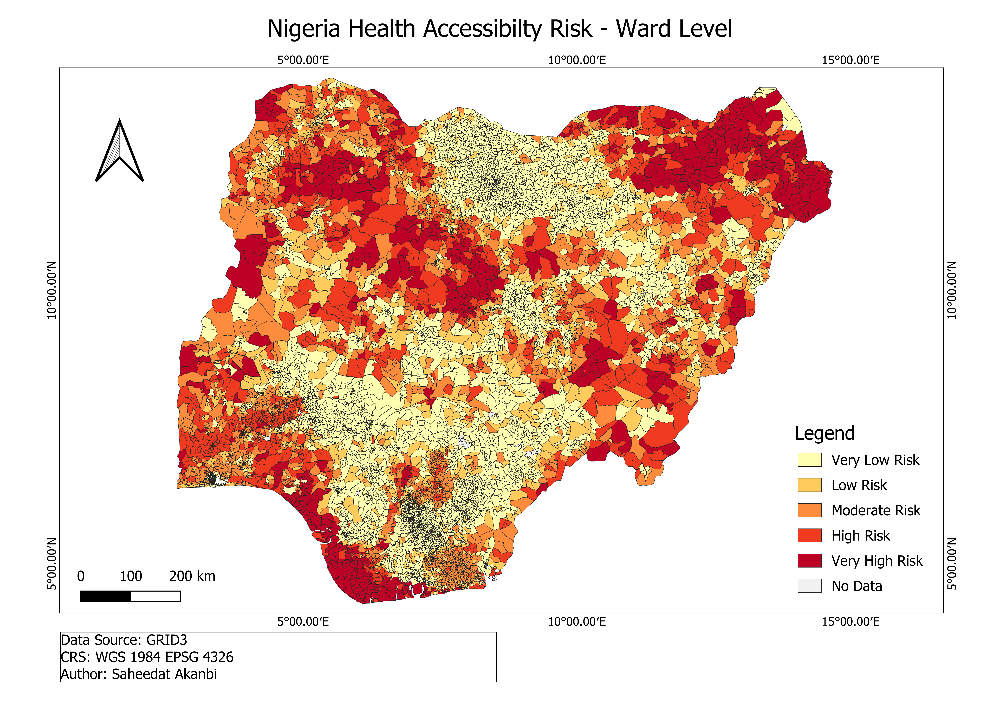
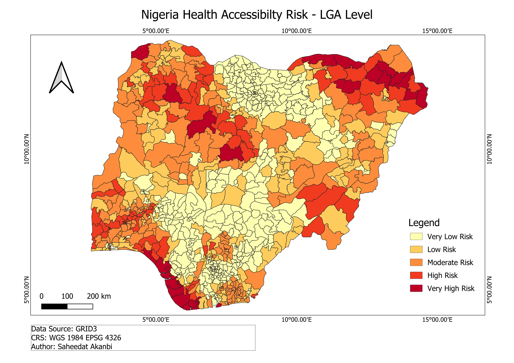
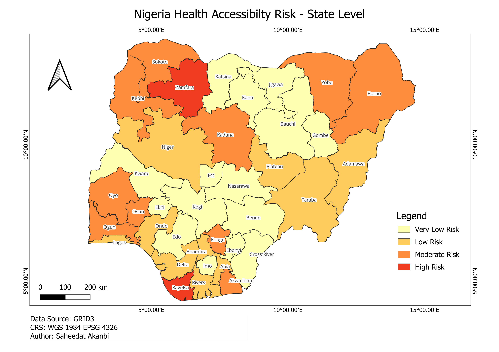
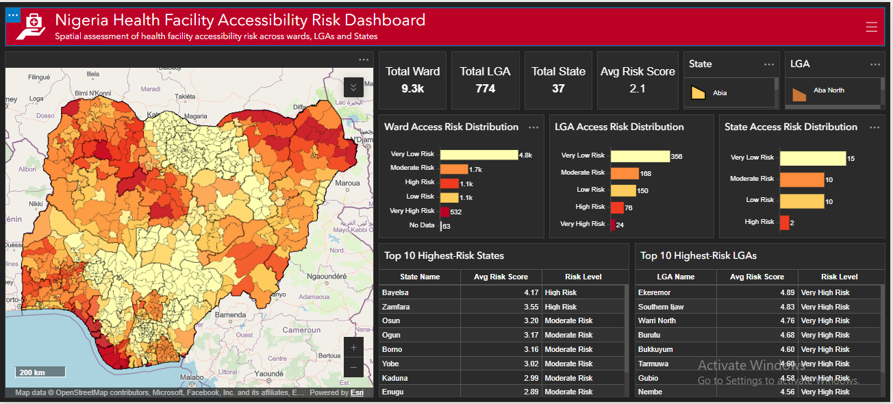

# Nigeria Health Accessibility Risk Analysis

## Overview

This project presents a geospatial analysis of health accessibility risk across Nigeria at three administrative levels: Ward, Local Government Area (LGA), and State.

The analysis uses the GRID3 health facility access risk dataset at ward level and aggregates the risk scores to LGA and State levels to examine broader spatial patterns.

The results are presented through thematic maps and an interactive ArcGIS Dashboard.

## Objectives

- Visualise health accessibility risk across Nigerian wards.
- Classify ward-level risk into five risk categories.
- Calculate average health accessibility risk scores at LGA and State levels.
- Identify the highest-risk LGAs and States.
- Develop an interactive dashboard for exploring the results.

## Data Source

**GRID3 - NGA Health Facilities Access Risk Score per Ward

## Methodology

The analysis followed these main steps:

1. Prepared the GRID3 ward-level health accessibility risk data.
2. Classified ward-level risk scores into five categories.
3. Calculated average risk scores for each LGA.
4. Calculated average risk scores for each State.
5. Classified the LGA and State average scores using the same five risk categories.
6. Created ward, LGA, and State level spatial visualisations.
7. Developed an interactive ArcGIS Dashboard.

## Risk Classification

- Very Low Risk - 1.0 – <1.8 
- Low Risk - 1.8 – <2.6 
- Moderate Risk - 2.6 – <3.4 
- High Risk - 3.4 – <4.2
- Very High Risk - 4.2 – 5.0

## Key Findings

### Ward Level

The analysis covers 9,410 wards.

- Very Low Risk - 4,795 (51.87% )
- Low Risk - 1,102 (11.92%)
- Moderate Risk - 1,692 (18.30%)
- High Risk - 1,124 (12.16%)
- Very High Risk - 532 (5.75%)
- No Data - 165 (1.75%)

Overall, 17.91% of wards with available risk scores are classified as High or Very High Risk.

### LGA Level

The analysis covers 774 LGAs.

- 356 LGAs - Very Low Risk
- 150 LGAs - Low Risk
- 168 LGAs - Moderate Risk
- 76 LGAs  - High Risk
- 24 LGAs  - Very High Risk

Therefore, 12.92% of LGAs are classified as High or Very High Risk.

### State Level

The analysis covers 37 State-level administrative units, including the FCT.

- 15 - Very Low Risk
- 10 - Low Risk
- 10 - Moderate Risk
- 2  - High Risk

Bayelsa recorded the highest average State-level risk score at 4.17, followed by Zamfara at 3.5.

No State-level average score falls within the Very High Risk category.

## Ward-Level Map

## LGA-Level Map

## State-Level Map

## Interactive Dashboard

The interactive ArcGIS Dashboard allows users to explore health accessibility risk across Ward, LGA, and State levels.

![Dashboard Link] 

## Tools

- QGIS
- ArcGIS Online
- ArcGIS Dashboards

## Acknowledgement

Data used in this project were obtained from GRID3 (Geo-Referenced Infrastructure and Demographic Data for Development).

The analysis, spatial processing, classification, mapping and dashboard development were carried out using QGIS and ArcGIS.

## Author

[Saheedat Akanbi](https://github.com/Holuwarkemmy)
